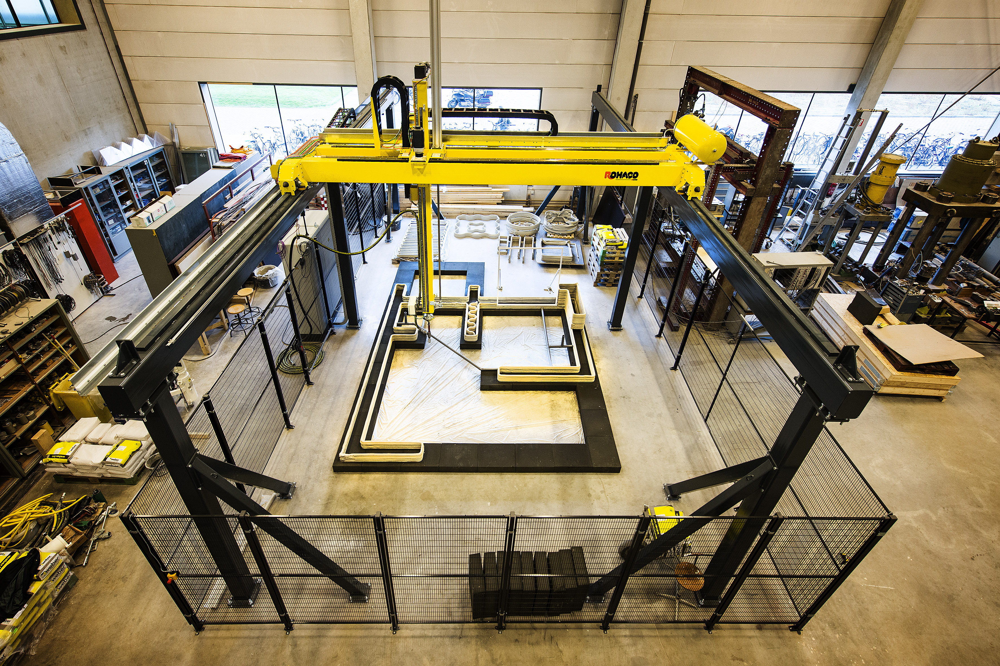
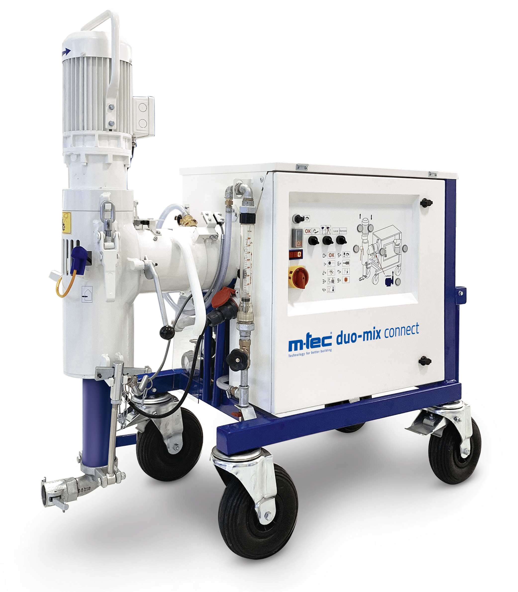
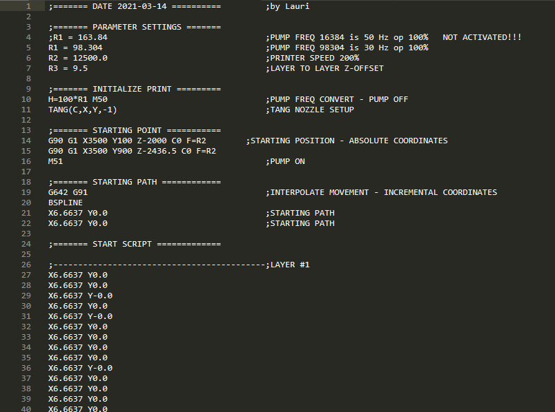
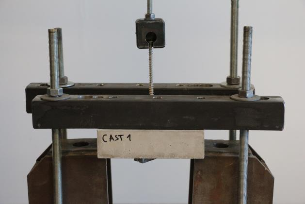
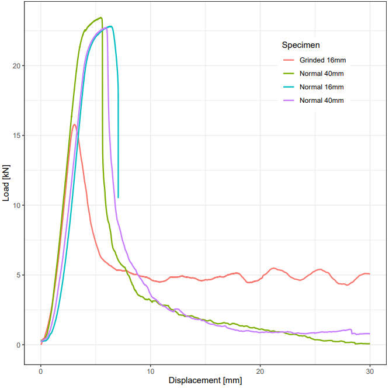
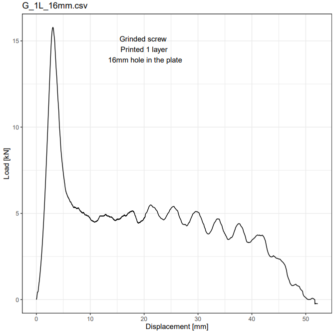

```{r setup, include=FALSE}
library(knitr)
knitr::opts_chunk$set(echo = TRUE, fig.align="center")

packages <- c(
  'ggplot2',
  'ggrepel',
  'patchwork',
  'ggraph',
  'dplyr',
  'gganimate',
  'gifski',
  'ggforce',
  'ggthemes',
  'maps',
  'sf',
  'tidyr',
  'concaveman',
  'remotes',
  'scales',
  'lubridate',
  'plotly',
  'gapminder',
  'stringr'
)


library(ggplot2)
library(scales)
library(lubridate)
library(plotly)
library(gapminder)
library(stringr)

suppressWarnings(suppressMessages(library(ggplot2)))
suppressWarnings(suppressMessages(library(scales)))
suppressWarnings(suppressMessages(library(lubridate)))
suppressWarnings(suppressMessages(library(plotly)))
suppressWarnings(suppressMessages(library(gapminder)))

```



## {.tabset .tabset-fade}

During printing multiple datasets are being recorded: 

    * Water flow L/min
    * Pump speed RPM
    * Water temperature
    * Pump temperature
    * X Y Z coordinates
    
A script is made that reads in the .csv file from the local folder where the data is saved and the outputs are graphs for waterflow, pump frequency, water and pump temperatures.

In addition XYZ coordinates are saved - for this a script is made to save these coordinates as .txt file that can be used as input in Rhino/Grasshopper to visualize a print path. A g-code is used to make a toolpath for the printer. A cript is also made to evaluate the script for visualizing a print path beforehand.

Finally a plotting script is done to read in pull-out results and make graphs out of it.

```{r load data, echo=FALSE}

printingdata <- read.csv(file = 'converted_data.csv', header = TRUE, sep = ";", dec = ",",colClasses = c("numeric", "numeric", "numeric", "numeric", "numeric", "numeric", "numeric", "numeric", "numeric", "numeric", "numeric", "numeric", "numeric", "numeric", "numeric", "numeric", "numeric", "numeric", "numeric","numeric", "numeric", "numeric", "numeric", "numeric", "numeric", "numeric", "numeric", "numeric","numeric", "numeric", "numeric", "numeric", "numeric", "numeric", "numeric", "numeric", "numeric", "numeric", "numeric", "numeric", "numeric", "numeric")) #loading data, and giving everything a data type of numeric, seperation ; decimal , 

colnames(printingdata) <- c("X_value", "X_time", "Y_value", "Y_time", "Z_value", "Z_time", "C_value", "C_time", "X_speed", "X_speedtime", "Y_speed", "Y_speedtime","Z_speed", "Z_speedtime","C_speed", "C_speedtime","X_feedrate", "X_feedratetime", "Y_feedrate", "Y_feedratetime", "Z_feedrate", "Z_feedratetime", "C_feedrate", "C_feedratetime", "feedrate_override", "feedrate_time", "watertemp", "watertemp_time", "waterflow", "waterflow_time", "pumppressure", "pumppressure_time", "pumptemp", "pumptemp_time", "pumprpm", "pumprpm_time",  "solvalbool", "solvalbool_time", "waterpumpbool", "waterpumpbool_time", "x1notsure", "x1notsure_time") #renaming all columns to have a better understanding of what it what

printingdata$X_time<-as.POSIXct(printingdata$X_time, origin = "1970-01-01", tz='UTC') #converting seconds from 1970 to printing time for each column
printingdata$Y_time<-as.POSIXct(printingdata$X_time, origin = "1970-01-01", tz='UTC')
printingdata$Z_time<-as.POSIXct(printingdata$X_time, origin = "1970-01-01", tz='UTC')
printingdata$C_time<-as.POSIXct(printingdata$X_time, origin = "1970-01-01", tz='UTC')
printingdata$X_speedtime<-as.POSIXct(printingdata$X_time, origin = "1970-01-01", tz='UTC')
printingdata$Y_speedtime<-as.POSIXct(printingdata$X_time, origin = "1970-01-01", tz='UTC')
printingdata$Z_speedtime<-as.POSIXct(printingdata$X_time, origin = "1970-01-01", tz='UTC')
printingdata$C_speedtime<-as.POSIXct(printingdata$X_time, origin = "1970-01-01", tz='UTC')
printingdata$X_feedratetime<-as.POSIXct(printingdata$X_time, origin = "1970-01-01", tz='UTC')
printingdata$Y_feedratetime<-as.POSIXct(printingdata$X_time, origin = "1970-01-01", tz='UTC')
printingdata$Z_feedratetime<-as.POSIXct(printingdata$X_time, origin = "1970-01-01", tz='UTC')
printingdata$C_feedratetime<-as.POSIXct(printingdata$X_time, origin = "1970-01-01", tz='UTC')
printingdata$feedrate_time<-as.POSIXct(printingdata$X_time, origin = "1970-01-01", tz='UTC')
printingdata$watertemp_time<-as.POSIXct(printingdata$X_time, origin = "1970-01-01", tz='UTC')
printingdata$waterflow_time<-as.POSIXct(printingdata$X_time, origin = "1970-01-01", tz='UTC')
printingdata$pumppressure_time <-as.POSIXct(printingdata$X_time, origin = "1970-01-01", tz='UTC')
printingdata$pumptemp_time<-as.POSIXct(printingdata$X_time, origin = "1970-01-01", tz='UTC')
printingdata$pumprpm_time<-as.POSIXct(printingdata$X_time, origin = "1970-01-01", tz='UTC')
printingdata$solvalbool_time<-as.POSIXct(printingdata$X_time, origin = "1970-01-01", tz='UTC')
printingdata$waterpumpbool_time<-as.POSIXct(printingdata$X_time, origin = "1970-01-01", tz='UTC')
printingdata$x1notsure_time<-as.POSIXct(printingdata$X_time, origin = "1970-01-01", tz='UTC')

printingdata$C_value<-NULL #hiding columns that for now we don't have use for
printingdata$C_time<-NULL
printingdata$C_speed<-NULL
printingdata$C_speedtime<-NULL
printingdata$X_feedrate <-NULL
printingdata$X_feedratetime<-NULL
printingdata$Y_feedrate<-NULL
printingdata$Y_feedratetime<-NULL
printingdata$Z_feedrate<-NULL
printingdata$Z_feedratetime<-NULL
printingdata$C_feedrate<-NULL
printingdata$C_feedratetime<-NULL
printingdata$feedrate_override<-NULL
printingdata$feedrate_time<-NULL
printingdata$pumppressure<-NULL
printingdata$pumppressure_time<-NULL
printingdata$solvalbool<-NULL
printingdata$solvalbool_time<-NULL
printingdata$waterpumpbool<-NULL
printingdata$x1notsure<-NULL
printingdata$x1notsure_time<-NULL
printingdata$waterpumpbool_time<-NULL

#write.csv(printingdata, file="test1.csv", sep="\t") Trying to write a new output file, need some lib
```


### Waterflow Analyser 

{width=30%} 

```{r waterflow, echo=FALSE}
p<- ggplot(data=printingdata) + #dataset called printinddata is being used
  geom_line(aes(waterflow_time, #aesthetics are being assigned to used data columns
                abs(waterflow)))+
                coord_cartesian(xlim = as.POSIXct(strptime(c("2021-02-08 13:42:02","2021-02-08 15:04:02"), #time is set
                                                           format = "%Y-%m-%d %H:%M:%S")), ylim = c(0,4))+
  xlab("Time") + ylab("Waterflow L/min") + ggtitle("Waterflow table for mixing") #labels and titles
ggplotly(p)

```

### RPM Analyser 

{width=30%} 

```{r RPM, echo=FALSE}

rpm<- ggplot(data=printingdata) +
  geom_line(aes(pumprpm_time,
                pumprpm*0.01666666*8))+
                coord_cartesian(xlim = as.POSIXct(strptime(c("2021-02-08 13:42:02","2021-02-08 15:04:02"),
                                                           format = "%Y-%m-%d %H:%M:%S")))+
  xlab("Time") + ylab("Hertz") + ggtitle("Frequenzy for printing")
ggplotly(rpm)

```

### Water Temperature 

{width=30%} 

```{r Temp, echo=FALSE}

temp<- ggplot(data=printingdata) +
  geom_line(aes(watertemp_time,
                watertemp))+
                coord_cartesian(xlim = as.POSIXct(strptime(c("2021-02-08 13:42:02","2021-02-08 15:04:02"),
                                                           format = "%Y-%m-%d %H:%M:%S")))+
  xlab("Time") + ylab("Temperature") + ggtitle("Water Temperature")
ggplotly(temp)

```

### Pump Temperature 

{width=30%} 

```{r PTemp, echo=FALSE}

ptemp<- ggplot(data=printingdata) +
  geom_line(aes(pumptemp_time,
                pumptemp))+
                coord_cartesian(xlim = as.POSIXct(strptime(c("2021-02-08 13:42:02","2021-02-08 15:04:02"),
                                                           format = "%Y-%m-%d %H:%M:%S")))+
  xlab("Time") + ylab("Temperature") + ggtitle("Pump Temperature")
ggplotly(ptemp)

```

### Layout Analyser

For printing a script is prepared for each object, where all the necessary data is given. In that script the following values are given: 

    * Z-offset
    * Decrease in layers
    * Amount of layers
    * Starting location
    * Printing Speed
    * Rotation
    * Coordinate system in G-code
    
Because we are printing multiple objects in one session, it can get confusing where what is printed, what is the workflow and what are overall properties for each object.
The goal for this part is that uploaded scripts are projected in 2D on the printbed, so you can see the layout of the print session with the properties. 

```{r XYZ, echo=FALSE}

XYZ <- data.frame(printingdata$X_value, printingdata$Y_value, printingdata$Z_value)
XYZc <- XYZ[11000:18000,]
write.table(XYZc, file = "rhinofile.txt", sep = ",", row.names = FALSE, col.names = FALSE, na = "0")

```





### Pull-out test

Simple pull-out test data analyser. From the pull out-test we get a data file with load and displacement. Output is a load-displacement graph for multiple samples.



